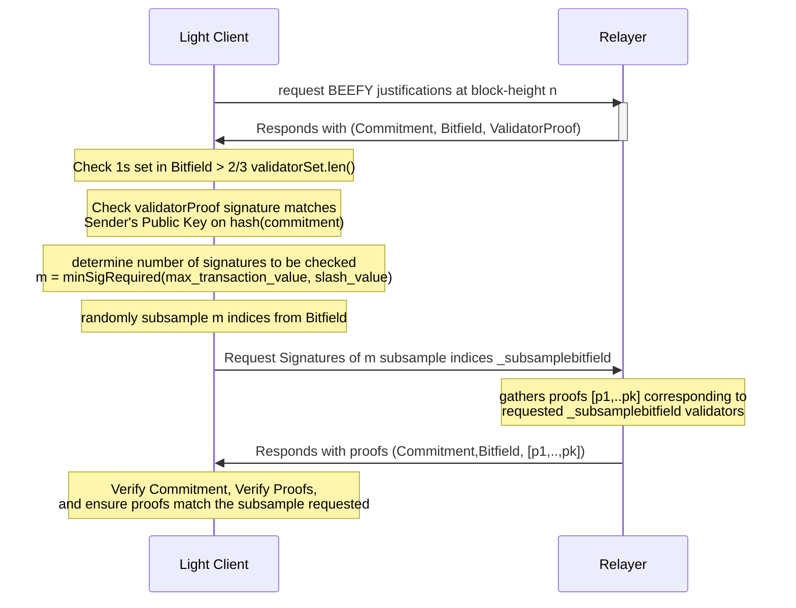
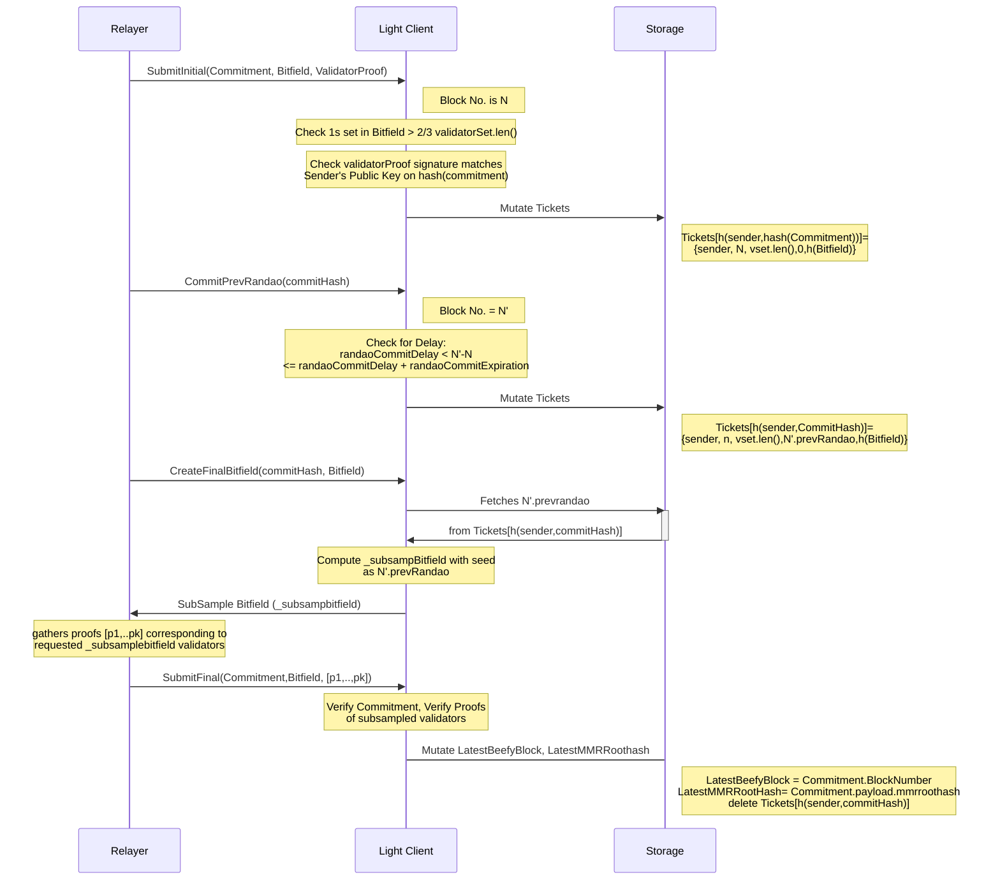

# Introduction

BEEFY is an additional consensus layer designed for Light Clients to follow Polkadot's finality. In this section, we take a closer look at the light-client side implementation, i.e., how how to frequently update the new BEEFY commitments. For details of the BEEFY finality process and host-side protocol, please refer to the [BEEFY Specifications](https://spec.polkadot.network/sect-finality#sect-grandpa-beefy). 
The BEEFY justifications (signed commitments or signed commitment witnesses) are circulated /gossiped similar to GRANDPA justifications on a dedicated network substream. The light client can directly listen to the [substream](https://spec.polkadot.network/chap-networking#sect-protocols-substreams) or rely upon a [relayer](https://spec.polkadot.network/sect-finality#defn-beefy-relayer) to fetch the latest finality  via the [payload](https://spec.polkadot.network/sect-finality#defn-beefy-payload) (the MMR root  of the chain containing the latest BEEFY finalized block). 

## V1: Warp Syncing with BEEFY
A light client with enough compute resources and bandwidth can deterministically verify the [payload](https://spec.polkadot.network/sect-finality#defn-beefy-payload) it receives. This is achieved by the light client checking at least $N/3 +1$ (where $N$ is the number of validators in active set) signatures from the current validator set. The process would exactly follow the warp sync described in [Light Client Spec](https://spec.polkadot.network/sect-lightclient#sect-sync-warp-lightclient), except that the BEEFY finality is followed instead of GRANDPA finality. Note that BEEFY finalizes only blocks that are GRANDPA finalized, however the signatures (`ECDSA`) used for BEEFY commitments are  different from those (`ed25519`) used for GRANDPA. It is also assured that at least one block is finalised in each epoch, hence the light client can track the validator set changes. 

## V2: Random Sampling using ECDSA-BEEFY Signatures
Random Sampling is an interactive protocol between the light client and a relayer. It provides probabilistic security guarantees for the authenticity and finality of the payload. The security guarantees of the approach are parametrized by the number of BEEFY signatures checked by the light client. A detailed security analysis is documented [here](https://hackmd.io/ZN2axLa7R8Gy8BVsNMGmyg).
 
There are 3 main components from light clients perspective:
1. Keeping track of the current and next validator set details (this includes the validator set id, validator set length, and the merkle root of the validator set). The [MMR leaf](https://spec.polkadot.network/sect-finality#defn-beefy-payload) of the latest block is passed over by the relayer.This contains the information about the next validator set which can be verified against the latest payload (since the payload is the root of an MMR containing the the latest block's MMR leaf). 
2. The light client ensures that active validators for the given epoch have signed the payload. The light client verifies the signature against the merkle root of the validator set (obtained in step-1). For light clients with resource constraint (e.g. running on another chain), it is unreasonable to expect checking all signatures. Hence, the light client starts an interactive protocol with probabilistic guarantees. A relaying source sends a list of validators signatures that it claims to have (only the bitfield indicating the validator indices and not the signatures themselves). The light client then randomly choses a subset of these indices, and requests the signatures of the validator on the payload, as well as the merkle co-path proving the inclusion of the validator in the Current/Next Validator set.
3. Once the relayer (or via directly listening to the BEEFY gossip stream) returns the array of corresponding validator signatures that were requested, the light client verifies the signatures and also checks whether the indices of validators match the ones it randomly sampled. 

The Message Sequence Chart below captures the interaction between a relayer (or any direct source of beefy justification gossip) and the light client. 

The light client local state with respect to Beefy interactions contains:
1. `LatestBeefyBlock`: Block number of the latest block with verified BEEFY finality.
2.  `latestMMRroot`: payload (MMR root with containing the leaf corresponding to latest BEEFY finalised block). 
3.  `CurrentValidatorSet` and `NextValidatorSet`: Merkle roots of the current and next validator sets. 
scd 

## V2: SNARKs using BLS-BEEFY Signatures
Work in Progress

## Further Reading:
SnowBridge (implementing an on-chain BEEFY light client on Ethereum) documentation can be found [here](https://docs.snowbridge.network/architecture/verification/polkadot). 

### Appendix-1: Message Sequence Chart of the interaction between Relayer and Light client on Ethereum along with state mutations.

